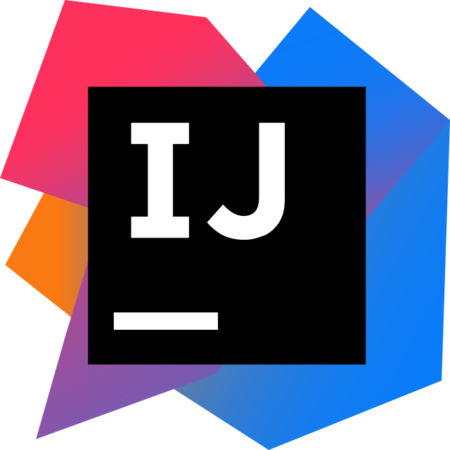
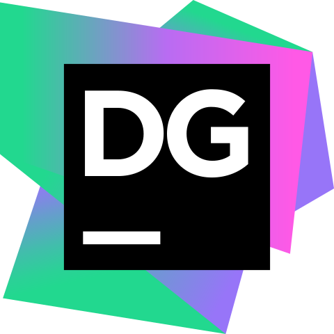

# 👋Introduction

Hi, I’m Jules a French student in IT, currently in 3rd year of a Bachelor in Computer Science at IUT Charlemagne in Nancy.

I would like to become a back-end programmer to work on various projects.

I also like working on little projects such as my personnal portfolio (one day) or little web applications, like my AnimeDle

# 💻Technologies

### 📱Technologies I know

  

### 🔨Tools I know

  
  
  
  
  
  
  
  
  

### 🎓Currently learning

  

### 🔍Wanting to learn

  

# 🚀Projects
### 🌟AnimeDle🚧
AnimeDle is an exciting project where users can put their anime knowledge to the test. The concept is simple yet engaging – guess the anime from blurred images! Users will be presented with images of different anime scenes that are intentionally blurred. The challenge is to correctly identify the anime based on these obscured visuals. The AnimeDle project is currently under development, and I'm actively working on creating a website.

### 🎨Portfolio🚧
My personal portfolio is a work in progress, where I'm in the process of creating a showcase of my skills and projects to present my journey in the field of IT and web development

# 📈My stats

